<h2 align='center'>Naïve Bees: <br>Image Loading and Processing<br>Predicting Species from Images</h2>
<p align='center'></p>
<p align="center">
  </a>
  </a>
  </a>
  </a>
</p>

<!-- 


  -->


<p>Can a machine identify a bee as a honey bee or a bumble bee?</p>

<h3>Part 1: Image Loadning & Processing </h3>

<p>Required Libraries</p>

```python
from pathlib import Path
from PIL import Image
from IPython.display import display
import numpy as np
import pandas as pd
import matplotlib.pyplot as plt
%matplotlib inline
```

<h3>1. Test Data</h3>

```python
test_data = np.random.beta(1, 1, size=(100, 100, 3))

plt.imshow(test_data)
```

<p align='left'></p>

<h3>2. Opening images with PIL</h3>

<p>Pillow is a very flexible image loading and manipulation library. </p>

```python
# open the image
img = Image.open('datasets/bee_1.jpg')

# Get the image size
img_size = img.size

print("The image size is: {}".format(img_size))

#display image
img

>>> The image size is: (100, 100)
```
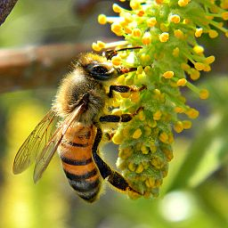


<h3>3. Image manipulation with PIL</h3>

<p>Pillow has a number of common image manipulation tasks built into the library.</p>
<ul>
<li>resizing</li>
<li>cropping</li>
<li>rotating</li>
<li>flipping</li>
<li>converting to greyscale</li>

<break>

```python
img_cropped = img.crop((25, 25, 75, 75))
display(img_cropped)

img_rotated = img.rotate(45,expand=25)
display(img_rotated)

img_flipped = img.transpose(Image.FLIP_LEFT_RIGHT)
display(img_flipped)
```
<p align='left'></p>

<h3>4. Images as arrays of data</h3>

<p>Most image formats have three color "channels": red, green, and blue (some images also have a fourth channel called "alpha" that controls transparency). The way this is represented as data is as a three-dimensional matrix.</p>

```python
img_data = np.array(img)

img_data_shape = img_data.shape

print("Our NumPy array has the shape: {}".format(img_data_shape))

plt.imshow(img_data)
plt.show()

# plot the red channel
plt.imshow(img_data[:,:,0], cmap=plt.cm.Reds_r)
plt.show()

# plot the green channel
plt.imshow(img_data[:,:,1], cmap=plt.cm.Greens_r)
plt.show()

# plot the blue channel
plt.imshow(img_data[:,:,2], cmap=plt.cm.Blues_r)
plt.show()

>>> Our NumPy array has the shape: (100, 100, 3)
```

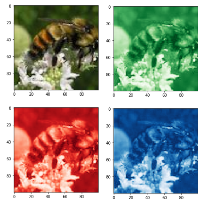
  
<h3>5. Explore the color channels </h3>
<p>Color channels can help provide more information about an image. This kind of information can be useful when building models or examining the differences between images.<br>Let's look at the kernel density estimate for each of the color channels on the same plot so that we can understand how they differ.</p>

```python
def plot_kde(channel, color):
    """ Plots a kernel density estimate for the given data.
        
        `channel` must be a 2d array
        `color` must be a color string, e.g. 'r', 'g', or 'b'
    """
    data = channel.flatten()
    return pd.Series(data).plot.density(c=color)

# create the list of channels
channels = ['r', 'g', 'b']
    
def plot_rgb(image_data):
    # use enumerate to loop over colors and indexes
    for ix, color in enumerate(channels):
        plot_kde(img_data[:, :, ix], color)
    
    plt.show()
    
plot_rgb(img_data)
```
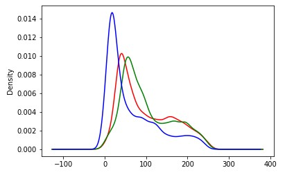


<h3>6. Honey bees and bumble bees</h3>
<p>Now we'll look at two different images and some of the differences between them.</p>

```python
honey = Image.open('datasets/bee_12.jpg')
bumble = Image.open('datasets/bee_3.jpg')

display(honey)
display(bumble)

honey_data = np.array(honey)
bumble_data = np.array(bumble)

plot_rgb(honey_data)
plot_rgb(bumble_data)
```

<p align='left'>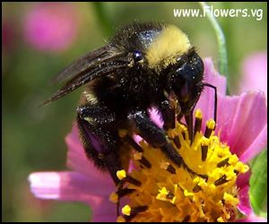</p>
<p align='left'>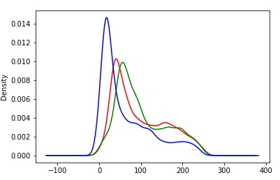</p>
<p align='left'>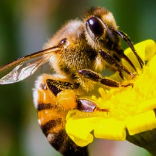</p>
<p align='left'>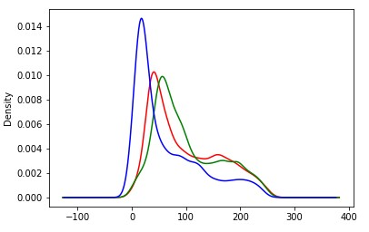</p>

<h3>8. Simplify</h3>
<p>We know that the colors of the flowers may be distracting from separating honey bees from bumble bees, so let's convert these images to black-and-white, or "grayscale." Because we change the number of color "channels," the shape of our array changes with this change. <p3>

```python
# convert honey to grayscale
honey_bw = honey.convert("L")

# convert the image to a NumPy array
honey_bw_arr = np.array(honey_bw)

honey_bw_arr_shape = honey_bw_arr.shape
print("Our NumPy array has the shape: {}".format(honey_bw_arr_shape))

plt.imshow(honey_bw_arr, cmap=plt.cm.gray)
plt.show()

plot_kde(honey_bw_arr, 'k')

>>> Our NumPy array has the shape: (100, 100)
```
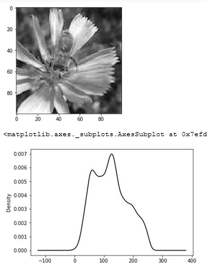</p>

<h3>Part 2: Building & Predicting </h3>

<h3>1. Import Python libraries</h3>

```python
import os

import matplotlib as mpl
import matplotlib.pyplot as plt
from IPython.display import display
%matplotlib inline

import pandas as pd
import numpy as np

from PIL import Image

from skimage.feature import hog
from skimage.color import rgb2grey

from sklearn.preprocessing import StandardScaler
from sklearn.decomposition import PCA
from sklearn.model_selection import train_test_split
from sklearn.svm import SVC

from sklearn.metrics import roc_curve, auc, accuracy_score
```

<h3>2. Display image of each bee type</h3>
<p>Let's load load our <code>labels.csv</code> file into a dataframe called labels, where the <code>index</code> is the image name (e.g. an index of 1036 refers to an image named 1036.jpg) and the genus column tells us the bee type. <code>genus</code> takes the value of either <code>0.0</code> (Apis or honey bee) or <code>1.0</code> (Bombus or bumble bee).</p>

```python
labels = pd.read_csv("datasets/labels.csv", index_col=0)
display(labels.head())

def get_image(row_id, root="datasets/"):
    """
    Converts an image number into the file path where the image is located, 
    opens the image, and returns the image as a numpy array.
    """
    filename = "{}.jpg".format(row_id)
    file_path = os.path.join(root, filename)
    img = Image.open(file_path)
    return np.array(img)

# subset the dataframe to just Apis (genus is 0.0) get the value of the sixth item in the index
apis_row = labels[labels.genus == 0.0].index[5]

# show the corresponding image of an Apis
plt.imshow(get_image(apis_row))
plt.show()

# subset the dataframe to just Bombus (genus is 1.0) get the value of the sixth item in the index
bombus_row = labels[labels.genus == 1.0].index[5]

# show the corresponding image of a Bombus
plt.imshow(get_image(bombus_row))
plt.show()
```
|      | genus | 
|-----:|------:|
|  id  |       |
|  520 | 1.0   |
| 3800 | 1.0   |
| 3289 | 1.0   |
| 2695 | 1.0   |
| 4922 | 1.0   |

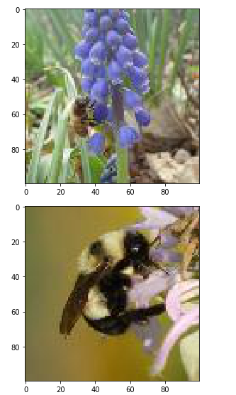

<h3>3. Image manipulation with rgb2grey</h3>
<p>The rgb2grey function computes the luminance of an RGB image using the following formula Y = 0.2125 R + 0.7154 G + 0.0721 B. </p>

```python
bombus = get_image(bombus_row)
grey_bombus = rgb2grey(bombus)
```

<h3>4. Histogram of oriented gradients</h3>
<p>The idea behind <b>HOG</b> is that an object's shape within an image can be inferred by its edges, and a way to identify edges is by looking at the direction of intensity gradients (i.e. changes in luminescence).</p>

<p align='center'>
  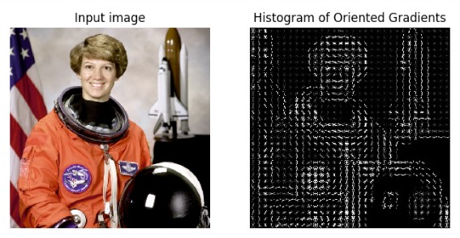
</p>

```python
hog_features, hog_image = hog(grey_bombus,
                              visualize=True,
                              block_norm='L2-Hys',
                              pixels_per_cell=(16, 16))

# show our hog_image with a grey colormap
plt.imshow(hog_image, cmap=mpl.cm.gray)
```
 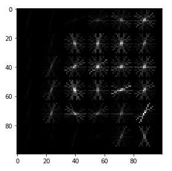

<h3>5. Create image features and flatten into a single row</h3>

<p>Algorithms require data to be in a format where rows correspond to images and columns correspond to features. This means that all the information for a given image needs to be contained in a single row. We want to provide our model with the raw pixel values from our images as well as the HOG features we just calculated. <br>Let's generate a flattened features array for the bombus image</p>

```python
def create_features(img):
    color_features = img.flatten()
    # convert image to greyscale
    grey_image = rgb2grey(img)
    # get HOG features from greyscale image
    hog_features = hog(grey_image, block_norm='L2-Hys', pixels_per_cell=(16, 16))
    # combine color and hog features into a single array
    flat_features = np.hstack([color_features, hog_features])
    return flat_features

bombus_features = create_features(bombus)

# print shape of bombus_features
bombus_features.shape

>>> (31296,)
```

<h3>6. Loop over images to preprocess</h3>
<p>Now it's time to loop over all of our images. We will create features for each image and then stack the flattened features arrays into a big matrix we can pass into our model.</p>

```python
def create_feature_matrix(label_dataframe):
    features_list = []
    
    for img_id in label_dataframe.index:
        img = get_image(img_id)
        image_features = create_features(img)
        features_list.append(image_features)
          
    feature_matrix = np.array(features_list)
    return feature_matrix

feature_matrix = create_feature_matrix(labels)
feature_matrix.shape # rows correspond to images and columns to features.

>>> (500, 31296)
```

<h3>7. Scale feature matrix + PCA</h3>

<p>Many machine learning methods are built to work best with data that has a mean of 0 and unit variance. Luckily there is <code>StandardScaler</code> method.</p>
<p>Also that we have over <code>31,000</code> features for each image and only <code>500</code> images total. To use an SVM, our model, we also need to reduce the number of features we have using <b>principal component analysis</b> (PCA).</p>

```python
print('Feature matrix shape is: ', feature_matrix.shape)

scaler = StandardScaler()
bees_stand = scaler.fit_transform(feature_matrix)

pca = PCA(n_components=500)
# use fit_transform to run PCA on our standardized matrix
bees_pca = pca.fit_transform(bees_stand)

print('PCA matrix shape is: ', bees_pca.shape)

>>> Feature matrix shape is:  (500, 31296)
>>> PCA matrix shape is:  (500, 500)
```

<h3>8. Split into train and test sets</h3>
<p>We'll use 70% of images as our training data and test our model on the remaining 30%.</p>

```python
X_train, X_test, y_train, y_test = train_test_split(bees_pca,
                                                    labels.genus.values,
                                                    test_size=.3,
                                                    random_state=1234123)
```

<h3>9. Train model</h3>
<p>We'll use a <b>support vector machine</b> (SVM), a type of supervised machine learning model. Since we have a classification task -- honey or bumble bee -- we will use the support vector classifier (SVC).</p>

```python
# define support vector classifier
svm = SVC(kernel='linear', probability=True, random_state=42)

# fit model
svm.fit(X_train, y_train)
```

<h3>10. Score model</h3>
<p>And finally, let's see how accurate is our model. Accuracy is the number of correct predictions divided by the total number of predictions.</p>

```python
y_pred = svm.predict(X_test)

accuracy = accuracy_score(y_test, y_pred)
accuracy

>>> 0.68
```

<h3>11. ROC curve + AUC</h3>
<p>The receiver operating characteristic curve (ROC curve) plots the false positive rate and true positive rate at different thresholds. ROC curves are judged visually by how close they are to the upper lefthand corner. <br>The area under the curve (AUC) is also calculated, where 1 means every predicted label was correct.</p>

```python
probabilities = svm.predict_proba(X_test)

# select the probabilities for label 1.0
y_proba = probabilities[:, 1]

false_positive_rate, true_positive_rate, thresholds = roc_curve(y_test, y_proba, pos_label=1)

roc_auc = auc(false_positive_rate, true_positive_rate)

plt.title('Receiver Operating Characteristic')
roc_plot = plt.plot(false_positive_rate,
                    true_positive_rate,
                    label='AUC = {:0.2f}'.format(roc_auc))

plt.legend(loc=0)
plt.plot([0,1], [0,1], ls='--')
plt.ylabel('True Positive Rate')
plt.xlabel('False Positive Rate');
```

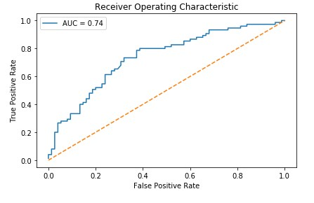
